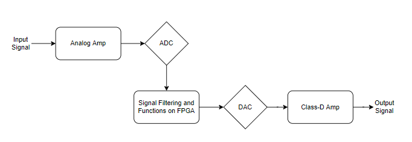
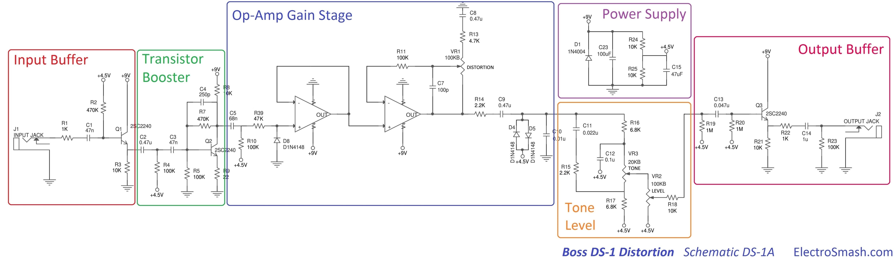

# FPGA_Implementation
Field programmable gate array (FPGA) board is now commonly-used in the industry to implement primary logics or testing. Powerful FPGA board is able to handle tasks like the general personal computer. Here, I presented several small projects and a cross-platform project concerning analogue-to-digital and digital-to-analogue (ADDA) on FPGA. Since the content about simple FPGA codes are everywhere on the internet, I will mainly focus on the description on the ADDA final project (Music Mixer). 

## Music Mixer
We attempted to devise a self-made music mixer based on Xilinx Nexys 4 board (not actually a pretty good one now lol). Below is the brief flow chart about the music mixer. At the outset, input signal from guitar would be transmitted to analog amplifier for better usage in the following sections. Then, analogue-to-digital converter on the FPGA port processed the amplified signal into the board. Later on, we duplicated the signals and designed several functions, e.g. echoing and voice effect, through verilog and matlab. Digital-to-analogue converter brings out the processed signals, followed by is class-D amplifier since we realized that the output signal was influenced to be too small. Eventually, our self-made music mixer was completed with tons of efforts. Details will be introduced in the succeeding parts.

*This is a small trailer of our music mixer: https://www.youtube.com/watch?v=UJXtSgm3TtA*

### Analog Amplifier
Our analog amplifier is referred to a classic model, BOSS DS1. 

### ADDA

### Signal Filtering and Voice Effect

### Class-D Amplifier

## Contact Info
Author: Chun-Sheng Wu, MS student in Computer Engineering @ Texas A&M University  
Email: jinsonwu@tamu.edu  
LinkedIn: https://www.linkedin.com/in/chunshengwu/
  
*This project was in collaboration with Yu-Chen Luo in National Chiao Tung University, 2019*
